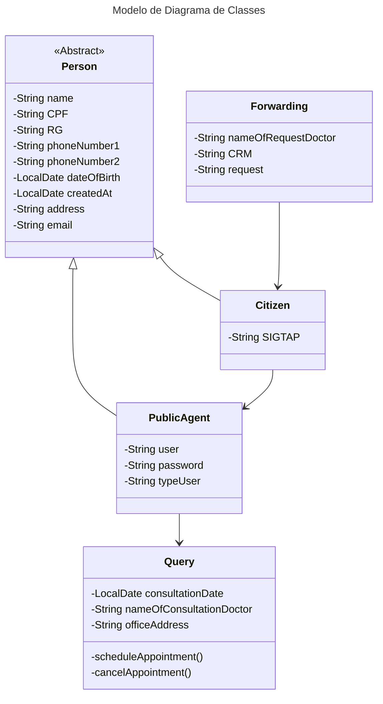
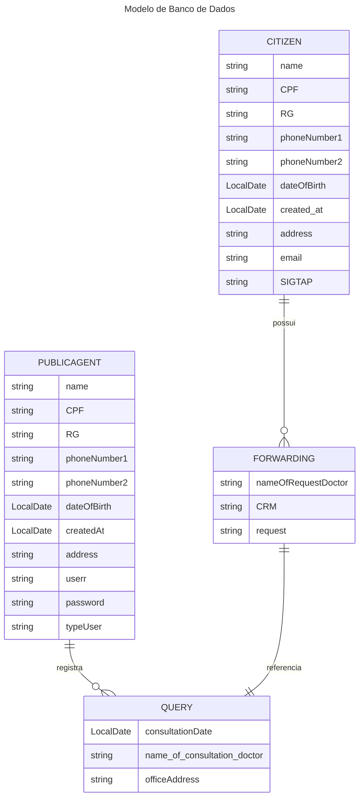

# **Agenda Dendê**

O projeto agenda Dendê se trata de um de aplicativo de marcação e gerenciamento de consultas voltado para a área da saúde, em resumo é um recurso que facilita o agendamento de consultas médicas operado principalmente pelos agentes de saúde, tornando a tarefa de agendar consultas muito mais simples, dinâmica e menos burocrática, tanto para os operadores, quanto para a população. Este projeto está sendo desenvolvido em virtude de avaliação na disciplina de Linguagem de programação II, sendo orientado pela professora Ana Cristina, do curso Bacharelado em Sistema de Informações.

## Minimundo e Fluxo de uso

### Motivação 

Diversas cidades em todo o Brasil, trabalham incessantemente para prestar o melhor serviço de marcação de consultas, entretanto é notório que grande parte do processo é realizado por meio físico gerando diversos problemas como a dificuldade de organizar as informações do paciente, além da lentidão do processo uma vez que as informações são gravadas em papel e passadas por diversas pessoas tornado o processo devagar e exageradamente burocrático, tendo isto nossa equipe propôs a produção de um meio de atualizar e automatizar grande parte dos procedimentos desde o cadastro dos cidadãos, atualização dos dados dos pacientes, marcação/agendamento de consultas e até a comunicação com os cidadãos atendidos.
 

### Problemas Identificados: 

1. Metodologias Manuais: Um dos grandes empecilhos identificados se trata da documentação impressa, ocasionado lentidão na coleta e análise de dados, além de ser uma pratica propensa a erros. 
   
2. Gargalos na Organização: O uso de métodos manuais dificulta a organização eficiente das informações dos pacientes, resultando em atrasos no agendamento, sobreposição de consultas e dificuldades na localização de registros.
   
3. Falta de Comunicação Eficiente: A comunicação entre a central e os pacientes atendidos é limitada e muitas vezes ineficaz, resultando em dificuldades na confirmação de consultas, lembretes e informações sobre procedimentos.

 
### Objetivos da Automatização:  

A automatização e a atualização do sistema central de marcação de consultas se provam necessária uma que os princípios da automatização incluem:

1. Eficiência Operacional: Implementar um sistema automatizado para simplificar e agilizar os processos de cadastro de cidadãos, atualização de dados dos pacientes e marcação/agendamento de consultas.

2. Organização e Gestão de Dados: Garantir uma gestão eficaz das informações dos pacientes, permitindo um acesso rápido e preciso aos registros, evitando sobreposições de consultas e melhorando a eficiência geral da central. 

3. Comunicação Aprimorada: Estabelecer canais de comunicação mais eficazes entre a central e os pacientes, permitindo a confirmação de consultas, envio de lembretes, notificações sobre resultados de exames e outras informações relevantes de forma oportuna e conveniente. 
 
 
### Das Funcionalidades  

O sistema deverá: 

 1. Gerenciar pacientes: adicionar pacientes ainda não cadastrados no sistema, e alterar uma eventual mudança nos dados do paciente.
 2. Gerenciar agentes públicos: (função especifica do gerente ou administrador) cadastrar novos agentes no sistema confiando-lhes um login e senha, e removendo o acesso de eventuais operários desligados do serviço.
 3. Gerenciar clinicas e médicos: cadastrar novas clinicas e médicos ainda não registrados no sistema, além de registrar status da clinicas cadastra e retirar do sistema, na ocasião do posto encerrar suas atividades, e quanto aos médicos alterar clinicas onde operam se houver mudança ou retirar da lista em caso de desligamento ou aposentadoria da função. 
 4. Solicitar marcação de consultas: criar um formulário de solicitação de consulta com base nos dados coletados do paciente, medico e clínica. 
 5. Confirmar agendamento de consulta: com a solicitação e uma análise nos horários da clinica e plantão do médico solicitado, haverá a confirmação do agendamento de consulta, sem conflito de data e horário entre pacientes ou médicos.
 6. Relatório de consultas: (função especifica do gerente ou administrador) com base nos dados das consultas marcadas, o aplicativo deverá emitir um relatório com gráfico informativo ao administrador do aplicativo. 

### Dos Menus: 

#### Menus (Normal)

**Login** 

 1. Usuário 
 2. Senha
 3. Login

**Menu Inicial** 

 1. Pacientes
 2. Consultas

**Menu Gerenciar Pacientes**

 1. Consultar paciente 
 2. Cadastrar paciente 
 3. Atualizar dados dos pacientes 

**Menu Agendamento**

 1. Agendar consulta 
 2. Confirmar consulta 

#### Menus (Admin: +2 telas e +2 opções no menu inicial)

**Menu Inicial**
1. Pacientes
2. Consultas
3. Relatorio
4. Gerenciar usuários
   
**Relatórios(Admin)**
1. Gerar relatório
2. Aplicar filtro
   

**Gerenciar usuários**
1. Adicionar
2. Editar
3. Buscar
   
### Diagrama de Classes

### Diagrama de Banco de Dados

